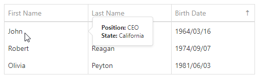

<!-- default badges list -->

<!-- default badges end -->
# DataGrid for DevExtreme - Display tooltip for data cells

This example illustrates how to display a custom [Tooltip](https://js.devexpress.com/Documentation/ApiReference/UI_Widgets/dxTooltip/) when the mouse hovers over the cells of a certain column. 

Handle the [onCellPrepared](https://js.devexpress.com/Documentation/ApiReference/UI_Widgets/dxDataGrid/Configuration/) event to subscribe to the cell's mouseover/mouseout event and populate the Tooltip with the associated data row values.

## Files to Look At

- **jQuery**
    - [index.html](jquery/index.html)
- **AngularJS**
    - [index.html](angularjs/index.html)
- **Angular**
    - [app.component.html](angular/src/app/app.component.html)
    - [app.component.ts](angular/src/app/app.component.ts)
- **Vue**
    - [App.vue](vue/src/App.vue)
- **React**
    - [App.js](react/src/App.js)
- **MVC**    
    - [Index.cshtml](mvc/Views/Home/Index.cshtml)

## Documentation

- [Getting Started with DataGrid](https://js.devexpress.com/Documentation/Guide/UI_Components/DataGrid/Getting_Started_with_DataGrid/)

- [DataGrid - API Reference](https://js.devexpress.com/Documentation/ApiReference/UI_Components/dxDataGrid/)

## More Examples

- [DataGrid for DevExtreme - How to implement a custom editing form using the Popup and Form components](https://github.com/DevExpress-Examples/devextreme-datagrid-custom-editing-form)

- [DataGrid for DevExtreme - How to implement a custom editing form in ASP.NET MVC](https://github.com/DevExpress-Examples/devextreme-asp-net-mvc-datagrid-custom-editing-form)
